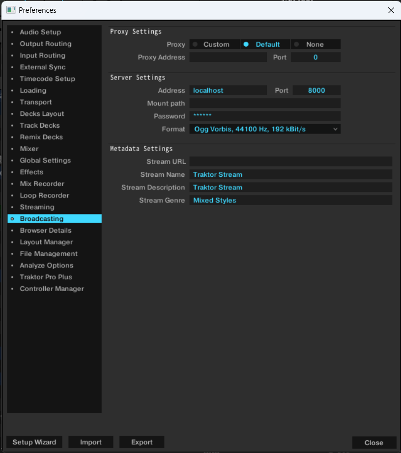
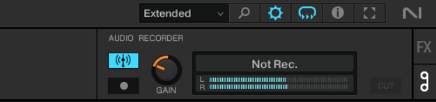

# playing-song-viewer
This is a Next.js application that retrieves some information of the currently playing song from the Icecast server and displays it.
It is mainly intended for use with Traktor Pro.

## Features
- Via the Icecast server, information about the song currently playing on Traktor DJ can be displayed in the browser.
- The artwork of the currently playing song can be displayed.
  - This feature uses metadata embedded in the music data, so it is only available for files where such data exists.
  - It is assumed that iTunes has automatically sorted the songs into directories; otherwise, different song artwork may be displayed or files may not be found.

## Preparation
### Install applications
Download the installer appropriate for your OS from [Download — Icecast](https://icecast.org/download/) and install it.

To build and run this project, you need to have installed Node.js, and pnpm.

Of course, in order to receive streams from Traktor DJ, you also need to install Traktor DJ :)

### Setup Traktor DJ
Open the settings of Traktor DJ and set the broadcast settings as shown in the image below.

Below is the default value of the Icecast server. If you have changed the port number or password, please change it accordingly.

- Address : `localhost`
- Port : `8000`
- Password : `hackme`

### Build this project
1. Clone this repository.
2. Install the dependencies with `pnpm install`.
3. Config `.env` file. Basically, you only need to set `ITUNES_MEDIA_DIRECTORY` to the directory where your music files are stored. Even if this directory is not sure, you only cannot display the artwork of the currently playing song.
4. Build with `pnpm build`.

## Start application
1. Start Icecast server. If your OS is Windows, just open the `icecast.bat`.
2. `pnpm start` to start the server.
3. Open Traktor Pro and start broadcasting.

4. Access http://localhost:3000 and you should see the song information.
5. If you need to access from another device, you need to access with the IP address of the device where the server is running. For example, http://192.168.1.10:3000.
